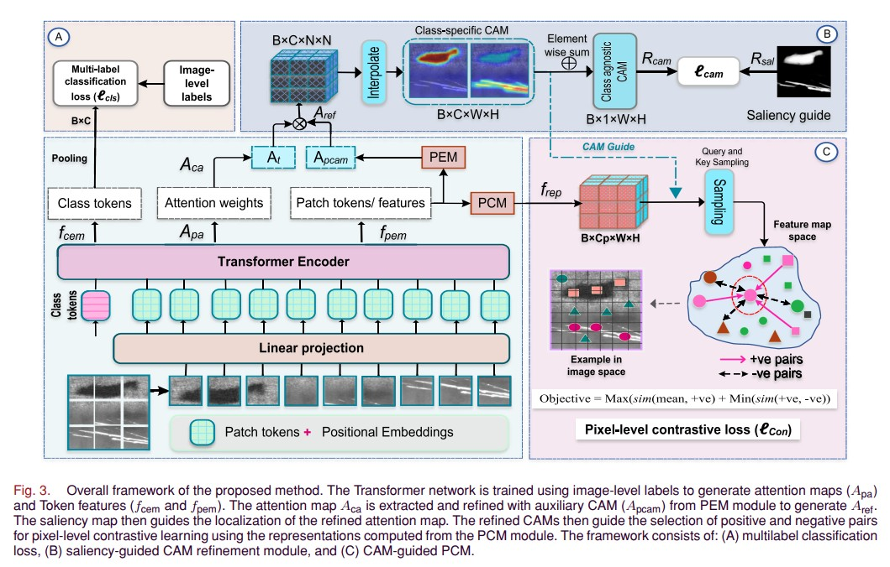
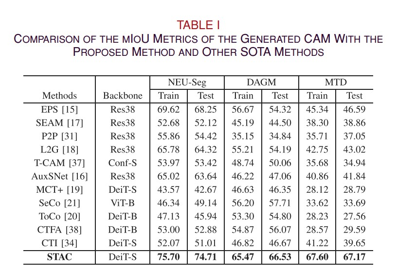
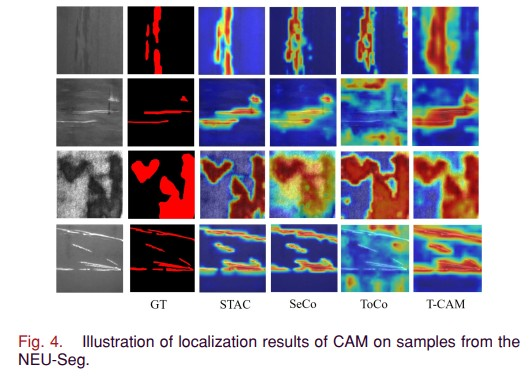
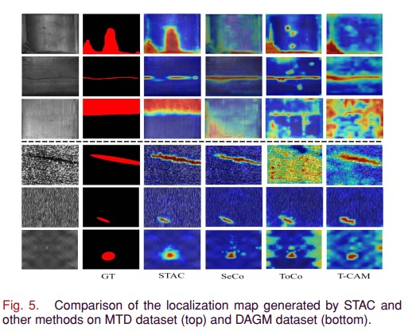
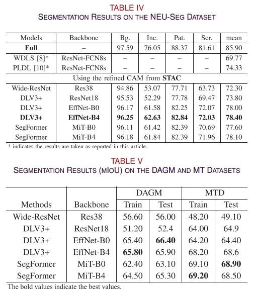
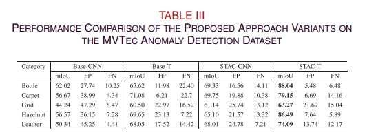
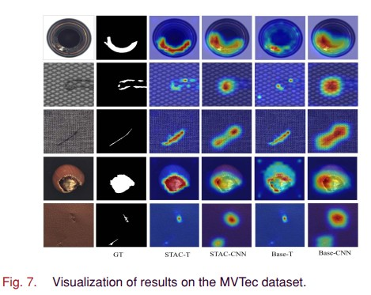
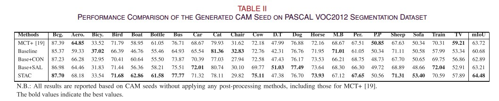
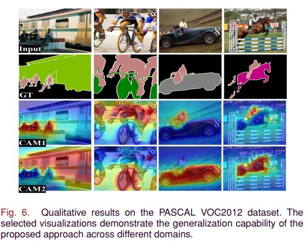
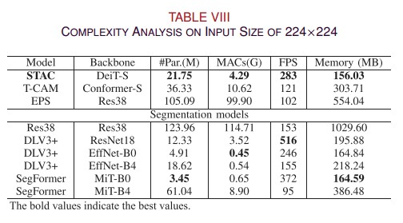

# STAC: Saliency-Guided Transformer Attention with Pixel-Level Contrastive Learning for Weakly Supervised Defect Localization

[]()
[]()
[]()

## 📄 Abstract

Weakly supervised learning has emerged as an effective paradigm for image segmentation by reducing the dependency on costly pixel-level annotations while maintaining competitive performance. However, existing weakly supervised approaches often suffer from overlapping activation regions, noisy localization signals, and insufficient boundary refinement, particularly in industrial defect datasets characterized by low contrast, irregular shapes, inter-class similarity, and significant intra-class variation.

To address these challenges, we propose **STAC (Saliency-Guided Transformer Attention with Pixel-Level Contrastive Learning)**, a novel framework for weakly supervised defect localization that leverages **Transformer-based attention** to generate localization maps and integrates **saliency-guided cues** to enhance foreground–background discrimination. Furthermore, a **pixel-level contrastive learning module** is introduced to refine feature representations by pulling semantically consistent pixels closer while pushing ambiguous and background pixels apart, effectively improving localization accuracy and boundary precision.

Extensive experiments and ablation studies demonstrate that **STAC consistently outperforms state-of-the-art weakly supervised methods** across multiple industrial defect segmentation datasets, including **NEU-Seg, DAGM, and MTD**, while also showing strong generalization capability on **PASCAL VOC** and **MVTec** datasets. The results highlight the effectiveness of saliency-guided attention and pixel-level contrastive learning in producing accurate and robust defect localization maps using only **image-level supervision**.

# 🚀 Full paper source:
Details and specific analysis is found at : ([https://ieeexplore.ieee.org/document/9994033](https://ieeexplore.ieee.org/document/11354152))

⭐ [Please Star this repo](https://github.com/djene-mengistu/STAC)
🔥 If you find it useful, please cite ourwork as follows:
```
@ARTICLE{STAC,
  author={Sime, Dejene M. and Ouyang, Nan and Sheng, Kai and Fellek, Getu T. and Wan, Wenkang and Qaseem, Adnan A. and Ren, Xiaojiang and Bu, Shehui},
  journal={IEEE Transactions on Industrial Informatics}, 
  title={Saliency-Guided Transformer Attention With Pixel-Level Contrastive Learning for Weakly Supervised Defect Localization}, 
  year={2026},
  volume={22},
  number={4},
  pages={3376-3387},
  keywords={Location awareness;Transformers;Weak supervision;Contrastive learning;Object segmentation;Manufacturing;Inspection;Annotations;Accuracy;Shape;Class-specific class activation map (CAM);contrastive learning;defect localization and segmentation;transformer attention;weakly supervised learning},
  doi={10.1109/TII.2025.3648429}}
```
## 🚀 Usage of this repository:
This repository provides scripts for training, evaluation, and segmentation using the STAC framework.  
Follow the steps below to reproduce the results.

1️⃣ Train STAC: run the 'run_STAC.sh'

2️⃣ Evaluate STAC: run the 'evaluation.py'

3️⃣ Segmentation Pipeline: create the pseudo labels from the seed CAM and run the codes in the 'Segmentation directory'

4️⃣ Apply to Different Datasets: Follow same procedure for all datasets

---


# 📌 Overview

Weakly supervised learning significantly reduces annotation costs in industrial defect localization by relying on image-level labels instead of pixel-wise annotations. However, existing approaches often suffer from:

- overlapping activation regions
- weak localization
- noisy attention maps
- low-contrast defect boundaries
- high intra-class variation
- strong inter-class similarity

To address these challenges, **STAC** introduces a **saliency-guided transformer attention mechanism with pixel-level contrastive learning**, enabling robust and accurate defect localization.

---

# 🧠 Method

The proposed STAC framework consists of three major components:

### 1️⃣ Transformer-based Localization Module
- Extracts global contextual features
- Generates class activation maps
- Captures long-range dependencies

### 2️⃣ Saliency-Guided Attention
- Focuses on foreground defect regions
- Suppresses background noise
- Improves localization accuracy

### 3️⃣ Pixel-Level Contrastive Learning
- Pulls similar pixels together
- Pushes dissimilar pixels apart
- Enhances feature discrimination
- Refines defect boundaries

---

# 🏗️ STAC Framework



# 🏗️ Results NEU-Seg MTD DAGM




# 🏗️ Segmentation Results 


# 🏗️ Resutls MVTEc



# 🏗️ PASCAL VOC2012



# 🏗️ Complexity


## 📬 Contact
For questions, collaborations, or further discussion regarding this work, please feel free to reach out:

📧 Email: djene.mengistu@gmail.com  
🌐 GitHub: https://github.com/djene-mengistu  
---

We welcome feedback, suggestions, and collaboration opportunities in industrial AI and weakly supervised learning research.


```markdown
